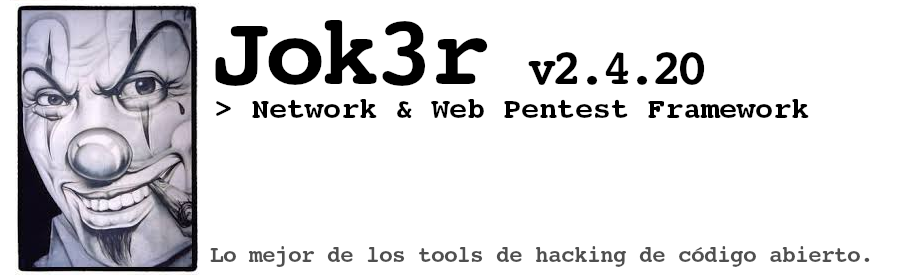

.. raw:: html

   

.. raw:: html

    

.. image:: https://img.shields.io/badge/python-3.6-blue.svg
    :target: https://www.python.org/downloads/release/python-366/
    :alt: Python 3.6

.. image:: https://readthedocs.org/projects/jok3r/badge/?version=latest
   :target: https://jok3r.readthedocs.io/en/latest/
   :alt: Documentation ReadTheDocs

.. image:: https://img.shields.io/docker/automated/koutto/jok3r.svg
    :target: https://hub.docker.com/r/koutto/jok3r/
    :alt: Docker Automated build

.. image:: https://img.shields.io/docker/build/koutto/jok3r.svg
    :alt: Docker Build Status

.. raw:: html

   

==========================================
Jok3r - Network and Web Pentest Framework
==========================================

*Jok3r* es una aplicación CLI de Python3 que está dirigida a **ayudar a los auditores de penetración
en infraestructuras de red y pruebas de seguridad web de black-box**. 

Su principal objetivo es **ahorrar tiempo en todo lo que se puede automatizar en la red/web
a auditar para disfrutar más tiempo en cosas más interesantes y desafiantes.**.

Para lograrlo, **he combinado herramientas para la auditoría de código abierto para ejecutar varios controles de seguridad, 
en todos los servicios de red comunes.**

=============
Características
=============
**Gestión de herramientas**: 

* Instala automáticamente todas las herramientas de hacking utilizadas por *Jok3r*,
* Mantiene herramientas actualizadas,
* Añade fácilmente nuevas herramientas.

**Automatización de ataques**: 

* Dirigido a los servicios de red más comunes (incluida la web),
* Ejecuta controles de seguridad mediante el encadenamiento de herramientas de auditoría, siguiendo el proceso estándar (Reconaissance, Análisis de vulnerabilidad, explotación, fuerza bruta, pos-explotación (básica).
* Deje que *Jok3r* elija automáticamente las comprobaciones para ejecutar de acuerdo con el contexto y el conocimiento sobre el objetivo,

**Gestión de misión / base de datos local**: 

* Organiza objetivos por misiones en base de datos local,
* Administra completamente las misiones y los objetivos (hosts/servicios) a través de shell interactivo (como msfconsole db),
* Accede a los resultados de los controles de seguridad.
    

*Jok3r* ha sido construido con la ambición de ser fácil y rápidamente personalizable: 
Herramientas, controles de seguridad, servicios de red soportados... puede ser fácil
añadido/editado/eliminado mediante la edición de archivos de configuración con una sintaxis fácil de entender.

============
Instalación
============
**La forma recomendada para usar Jok3r es dentro de un contenedor Docker, no te preocupes por
problemas de dependencia al instalar las diversas herramientas de auditoría.**

.. image:: https://raw.githubusercontent.com/koutto/jok3r/master/pictures/docker-logo.png

Una imagen de Docker está disponible en Docker Hub y se reconstruye automáticamente en cada actualización: 
https://hub.docker.com/r/koutto/jok3r/. Basado inicialmente en Kali / Debian oficial.
Imagen Linux Docker (kalilinux/kali-linux-docker).

.. image:: https://images.microbadger.com/badges/image/koutto/jok3r.svg
   :target: https://microbadger.com/images/koutto/jok3r
   :alt: Docker Image size

**Imagen Pull Jok3r Docker:**

.. code-block:: console

    sudo docker pull koutto/jok3r

**Ejecutar contenedor Docker actualizado:**

.. code-block:: console

    sudo docker run -i -t --name jok3r-container -w /root/jok3r --net=host koutto/jok3r

**Importante: --net=host opción requerida para compartir la interfaz del host. Se necesita para revertir
conexiones (por ejemplo, hacer ping al contenedor al probar RCE, obtienes un shell inverso))**

Jok3r toolbox está listo para usar!

* Para ejecutar un contenedor detenido:

.. code-block:: console

    sudo docker start -i jok3r-container

* Abrir múltiples terminales dentro un contenedor:

.. code-block:: console

    sudo docker exec -it jok3r-container bash

====================
Ejemplos de uso rápido
====================

**Mostrar todas las herramientas**

.. code-block:: console

    python3 jok3r.py toolbox --show-all

**Instalar todas las herramientas**

.. code-block:: console

    python3 jok3r.py toolbox --install-all --fast

**Actualizar todas las herramientas**

.. code-block:: console

    python3 jok3r.py toolbox --update-all --fast

**Lista de servicios soportados**

.. code-block:: console

    python3 jok3r.py info --services

**Mostrar controles de seguridad para HTTP**

.. code-block:: console

    python3 jok3r.py info --checks http

**Crear una nueva misión en la base de datos local.**

.. code-block:: console

    python3 jok3r.py db

    jok3rdb[default]> mission -a MiAuditoria

    [+] Mission "MiAuditoria" Agregado exitosamente
    [*] La mision seleccionada es MiAuditoria

    jok3rdb[MiAuditoria]> 

**Ejecutar controles de seguridad en una URL y agreguar resultados a la misión**

.. code-block:: console

    python3 jok3r.py attack -t https://www.sapos.com/webapp/ --add MiAuditoria

**Ejecuta controles de seguridad al servicio MSSQL (sin interacción del usuario) y añade resultados a la misión.**

.. code-block:: console

    python3 jok3r.py attack -t 190.212.190.133:1433 -s mssql --add MiAuditoria --fast

**Importar hosts/servicios de los resultados de Nmap al alcance de la misión**

.. code-block:: console

    python3 jok3r.py db

    jok3rdb[default]> mission MiAuditoria

    [*] Selected mission is now MiAuditoria

    jok3rdb[MiAuditoria]> nmap results.xml

**Comprobar seguridad para servicios en la misión dada y almacene los resultados en la base de datos**

.. code-block:: console

    python3 jok3r.py attack -m MiAuditoria --fast

**Comprobar seguridad solo en los servicios FTP en los puertos 21/tcp y 2121/tcp de la misión**

.. code-block:: console

    python3 jok3r.py attack -m MiAuditoria -f "port=21,2121;service=ftp" --fast

**Comprobar seguridad solo en los servicios FTP en los puertos 2121/tcp y todos los servicios HTTP 
en 190.212.190.133 de la misión**

.. code-block:: console

    python3 jok3r.py attack -m MiAuditoria -f "port=2121;service=ftp" -f "ip=190.212.190.133;service=http"

======================
Ejemplo de uso frecuentes
======================
Comienzas una auditoría con varios servidores. Aquí hay un ejemplo frecuente en *JoK3r*:

1. Ejecutar *Nmap* escanear en los servidores frecuentes

2. Crea una nueva misión (digamos "MiAuditoria") en la base de datos local:

.. code-block:: console

    python3 jok3r.py db

    jok3rdb[default]> mission -a MiAuditoria

    [+] Mission "MiAuditoria" successfully added
    [*] La misión seleccionada es MiAuditoria

    jok3rdb[MiAuditoria]> 

3. Importa tus resultados de *Nmap* escaneados:

.. code-block:: console

    jok3rdb[MiAuditoria]> nmap resultados.xml

4. Puede tener una visión general rápida de todos los servicios y hosts, agregar algunos comentarios, agregar
    algunas credenciales si ya tiene algún conocimiento sobre los objetivos (grey box pentest) y así sucesivamente

.. code-block:: console

    jok3rdb[MiAuditoria]> hosts

    [...]

    jok3rdb[MiAuditoria]> services

    [...]

5. Ahora, haga comprobaciones de seguridad contra algunos objetivos. Por ejemplo, para
    ejecutar comprobaciones para los servicios de Java-RMI, puede ejecutar el siguiente comando:

.. code-block:: console

    python3 jok3r.py attack -m MiAuditoria -f "service=java-rmi" --fast

6. Puede ver los resultados de los controles de seguridad en vivo cuando las herramientas están
    ejecutado o posteriormente desde la base de datos usando el siguiente comando:

.. code-block:: console

    jok3rdb[MayhemProject]> results

==================
Documentación completa
==================
La documentación está disponible en: pronto...

============================================================
Servicios admitidos y controles de seguridad (Actualizado el 01/04/2019)
============================================================

**¡Quedan muchos controles por implementar y se deben agregar servicios! Trabajo en progreso ...**

-  `AJP (default 8009/tcp)`_
-  `FTP (default 21/tcp)`_
-  `HTTP (default 80/tcp)`_
-  `Java-RMI (default 1099/tcp)`_
-  `JDWP (default 9000/tcp)`_
-  `MSSQL (default 1433/tcp)`_
-  `MySQL (default 3306/tcp)`_
-  `Oracle (default 1521/tcp)`_
-  `PostgreSQL (default 5432/tcp)`_
-  `RDP (default 3389/tcp)`_
-  `SMB (default 445/tcp)`_
-  `SMTP (default 25/tcp)`_
-  `SNMP (default 161/udp)`_
-  `SSH (default 22/tcp)`_
-  `Telnet (default 21/tcp)`_
-  `VNC (default 5900/tcp)`_

AJP (default 8009/tcp)
----------------------

.. code-block:: console

    +------------------------+------------+-------------------------------------------------------------------------------------------------+----------------+
    | Name                   | Category   | Description                                                                                     | Tool used      |
    +------------------------+------------+-------------------------------------------------------------------------------------------------+----------------+
    | nmap-recon             | recon      | Recon using Nmap AJP scripts                                                                    | nmap           |
    | tomcat-version         | recon      | Fingerprint Tomcat version through AJP                                                          | ajpy           |
    | vuln-lookup            | vulnscan   | Vulnerability lookup in Vulners.com (NSE scripts) and exploit-db.com (lots of false positive !) | vuln-databases |
    | default-creds-tomcat   | bruteforce | Check default credentials for Tomcat Application Manager                                        | ajpy           |
    | deploy-webshell-tomcat | exploit    | Deploy a webshell on Tomcat through AJP                                                         | ajpy           |
    +------------------------+------------+-------------------------------------------------------------------------------------------------+----------------+

FTP (default 21/tcp)
--------------------

.. code-block:: console

    +------------------+------------+-------------------------------------------------------------------------------------------------+----------------+
    | Name             | Category   | Description                                                                                     | Tool used      |
    +------------------+------------+-------------------------------------------------------------------------------------------------+----------------+
    | nmap-recon       | recon      | Recon using Nmap FTP scripts                                                                    | nmap           |
    | nmap-vuln-lookup | vulnscan   | Vulnerability lookup in Vulners.com (NSE scripts) and exploit-db.com (lots of false positive !) | vuln-databases |
    | ftpmap-scan      | vulnscan   | Identify FTP server soft/version and check for known vulns                                      | ftpmap         |
    | common-creds     | bruteforce | Check common credentials on FTP server                                                          | patator        |
    | bruteforce-creds | bruteforce | Bruteforce FTP accounts                                                                         | patator        |
    +------------------+------------+-------------------------------------------------------------------------------------------------+----------------+

HTTP (default 80/tcp)
---------------------

.. code-block:: console

    +--------------------------------------+-------------+--------------------------------------------------------------------------------------------------+--------------------------------+
    | Name                                 | Category    | Description                                                                                      | Tool used                      |
    +--------------------------------------+-------------+--------------------------------------------------------------------------------------------------+--------------------------------+
    | nmap-recon                           | recon       | Recon using Nmap HTTP scripts                                                                    | nmap                           |
    | load-balancing-detection             | recon       | HTTP load balancer detection                                                                     | halberd                        |
    | waf-detection                        | recon       | Identify and fingerprint WAF products protecting website                                         | wafw00f                        |
    | tls-probing                          | recon       | Identify the implementation in use by SSL/TLS servers (might allow server fingerprinting)        | tls-prober                     |
    | fingerprinting-multi-whatweb         | recon       | Identify CMS, blogging platforms, JS libraries, Web servers                                      | whatweb                        |
    | fingerprinting-app-server            | recon       | Fingerprint application server (JBoss, ColdFusion, Weblogic, Tomcat, Railo, Axis2, Glassfish)    | clusterd                       |
    | fingerprinting-server-domino         | recon       | Fingerprint IBM/Lotus Domino server                                                              | domiowned                      |
    | fingerprinting-cms-wig               | recon       | Identify several CMS and other administrative applications                                       | wig                            |
    | fingerprinting-cms-cmseek            | recon       | Detect CMS (130+ supported), detect version on Drupal, advanced scan on Wordpress/Joomla         | cmseek                         |
    | fingerprinting-cms-fingerprinter     | recon       | Fingerprint precisely CMS versions (based on files checksums)                                    | fingerprinter                  |
    | fingerprinting-cms-cmsexplorer       | recon       | Find plugins and themes (using bruteforce) installed in a CMS (Wordpress, Drupal, Joomla, Mambo) | cmsexplorer                    |
    | fingerprinting-drupal                | recon       | Fingerprint Drupal 7/8: users, nodes, default files, modules, themes enumeration                 | drupwn                         |
    | crawling-fast                        | recon       | Crawl website quickly, analyze interesting files/directories                                     | dirhunt                        |
    | crawling-fast2                       | recon       | Crawl website and extract URLs, files, intel & endpoints                                         | photon                         |
    | vuln-lookup                          | vulnscan    | Vulnerability lookup in Vulners.com (NSE scripts) and exploit-db.com (lots of false positive !)  | vuln-databases                 |
    | ssl-check                            | vulnscan    | Check for SSL/TLS configuration                                                                  | testssl                        |
    | vulnscan-multi-nikto                 | vulnscan    | Check for multiple web vulnerabilities/misconfigurations                                         | nikto                          |
    | default-creds-web-multi              | vulnscan    | Check for default credentials on various web interfaces                                          | changeme                       |
    | webdav-scan-davscan                  | vulnscan    | Scan HTTP WebDAV                                                                                 | davscan                        |
    | webdav-scan-msf                      | vulnscan    | Scan HTTP WebDAV                                                                                 | metasploit                     |
    | webdav-internal-ip-disclosure        | vulnscan    | Check for WebDAV internal IP disclosure                                                          | metasploit                     |
    | webdav-website-content               | vulnscan    | Detect webservers disclosing its content through WebDAV                                          | metasploit                     |
    | http-put-check                       | vulnscan    | Detect the support of dangerous HTTP PUT method                                                  | metasploit                     |
    | apache-optionsbleed-check            | vulnscan    | Test for the Optionsbleed bug in Apache httpd (CVE-2017-9798)                                    | optionsbleed                   |
    | shellshock-scan                      | vulnscan    | Detect if web server is vulnerable to Shellshock (CVE-2014-6271)                                 | shocker                        |
    | iis-shortname-scan                   | vulnscan    | Scan for IIS short filename (8.3) disclosure vulnerability                                       | iis-shortname-scanner          |
    | iis-internal-ip-disclosure           | vulnscan    | Check for IIS internal IP disclosure                                                             | metasploit                     |
    | tomcat-user-enum                     | vulnscan    | Enumerate users on Tomcat 4.1.0 - 4.1.39, 5.5.0 - 5.5.27, and 6.0.0 - 6.0.18                     | metasploit                     |
    | jboss-vulnscan-multi                 | vulnscan    | Scan JBoss application server for multiple vulnerabilities                                       | metasploit                     |
    | jboss-status-infoleak                | vulnscan    | Queries JBoss status servlet to collect sensitive information (JBoss 4.0, 4.2.2 and 4.2.3)       | metasploit                     |
    | jenkins-infoleak                     | vulnscan    | Enumerate a remote Jenkins-CI installation in an unauthenticated manner                          | metasploit                     |
    | cms-multi-vulnscan-cmsmap            | vulnscan    | Check for vulnerabilities in CMS Wordpress, Drupal, Joomla                                       | cmsmap                         |
    | wordpress-vulscan                    | vulnscan    | Scan for vulnerabilities in CMS Wordpress                                                        | wpscan                         |
    | wordpress-vulscan2                   | vulnscan    | Scan for vulnerabilities in CMS Wordpress                                                        | wpseku                         |
    | joomla-vulnscan                      | vulnscan    | Scan for vulnerabilities in CMS Joomla                                                           | joomscan                       |
    | joomla-vulnscan2                     | vulnscan    | Scan for vulnerabilities in CMS Joomla                                                           | joomlascan                     |
    | joomla-vulnscan3                     | vulnscan    | Scan for vulnerabilities in CMS Joomla                                                           | joomlavs                       |
    | drupal-vulnscan                      | vulnscan    | Scan for vulnerabilities in CMS Drupal                                                           | droopescan                     |
    | magento-vulnscan                     | vulnscan    | Check for misconfigurations in CMS Magento                                                       | magescan                       |
    | silverstripe-vulnscan                | vulnscan    | Scan for vulnerabilities in CMS Silverstripe                                                     | droopescan                     |
    | vbulletin-vulnscan                   | vulnscan    | Scan for vulnerabilities in CMS vBulletin                                                        | vbscan                         |
    | liferay-vulnscan                     | vulnscan    | Scan for vulnerabilities in CMS Liferay                                                          | liferayscan                    |
    | angularjs-csti-scan                  | vulnscan    | Scan for AngularJS Client-Side Template Injection                                                | angularjs-csti-scanner         |
    | jboss-deploy-shell                   | exploit     | Try to deploy shell on JBoss server (jmx|web|admin-console, JMXInvokerServlet)                   | jexboss                        |
    | struts2-rce-cve2017-5638             | exploit     | Exploit Apache Struts2 Jakarta Multipart parser RCE (CVE-2017-5638)                              | jexboss                        |
    | struts2-rce-cve2017-9805             | exploit     | Exploit Apache Struts2 REST Plugin XStream RCE (CVE-2017-9805)                                   | struts-pwn-cve2017-9805        |
    | struts2-rce-cve2018-11776            | exploit     | Exploit Apache Struts2 misconfiguration RCE (CVE-2018-11776)                                     | struts-pwn-cve2018-11776       |
    | tomcat-rce-cve2017-12617             | exploit     | Exploit for Apache Tomcat JSP Upload Bypass RCE (CVE-2017-12617)                                 | exploit-tomcat-cve2017-12617   |
    | jenkins-cliport-deserialize          | exploit     | Exploit Java deserialization in Jenkins CLI port                                                 | jexboss                        |
    | weblogic-t3-deserialize-cve2015-4852 | exploit     | Exploit Java deserialization in Weblogic T3(s) (CVE-2015-4852)                                   | loubia                         |
    | weblogic-t3-deserialize-cve2017-3248 | exploit     | Exploit Java deserialization in Weblogic T3(s) (CVE-2017-3248)                                   | exploit-weblogic-cve2017-3248  |
    | weblogic-t3-deserialize-cve2018-2893 | exploit     | Exploit Java deserialization in Weblogic T3(s) (CVE-2018-2893)                                   | exploit-weblogic-cve2018-2893  |
    | weblogic-wls-wsat-cve2017-10271      | exploit     | Exploit WLS-WSAT in Weblogic - CVE-2017-10271                                                    | exploit-weblogic-cve2017-10271 |
    | drupal-cve-exploit                   | exploit     | Check and exploit CVEs in CMS Drupal 7/8 (include Drupalgeddon2) (require user interaction)      | drupwn                         |
    | bruteforce-domino                    | bruteforce  | Bruteforce against IBM/Lotus Domino server                                                       | domiowned                      |
    | bruteforce-wordpress                 | bruteforce  | Bruteforce Wordpress accounts                                                                    | wpseku                         |
    | bruteforce-joomla                    | bruteforce  | Bruteforce Joomla account                                                                        | xbruteforcer                   |
    | bruteforce-drupal                    | bruteforce  | Bruteforce Drupal account                                                                        | xbruteforcer                   |
    | bruteforce-opencart                  | bruteforce  | Bruteforce Opencart account                                                                      | xbruteforcer                   |
    | bruteforce-magento                   | bruteforce  | Bruteforce Magento account                                                                       | xbruteforcer                   |
    | web-path-bruteforce-targeted         | bruteforce  | Bruteforce web paths when language is known (extensions adapted) (use raft wordlist)             | dirsearch                      |
    | web-path-bruteforce-blind            | bruteforce  | Bruteforce web paths when language is unknown (use raft wordlist)                                | wfuzz                          |
    | web-path-bruteforce-opendoor         | bruteforce  | Bruteforce web paths using OWASP OpenDoor wordlist                                               | wfuzz                          |
    | wordpress-shell-upload               | postexploit | Upload shell on Wordpress if admin credentials are known                                         | wpforce                        |
    +--------------------------------------+-------------+--------------------------------------------------------------------------------------------------+--------------------------------+

Java-RMI (default 1099/tcp)
---------------------------

.. code-block:: console

    +--------------------------------+-------------+--------------------------------------------------------------------------------------------------------+----------------+
    | Name                           | Category    | Description                                                                                            | Tool used      |
    +--------------------------------+-------------+--------------------------------------------------------------------------------------------------------+----------------+
    | nmap-recon                     | recon       | Attempt to dump all objects from Java-RMI service                                                      | nmap           |
    | rmi-enum                       | recon       | Enumerate RMI services                                                                                 | barmie         |
    | jmx-info                       | recon       | Get information about JMX and the MBean server                                                         | twiddle        |
    | vuln-lookup                    | vulnscan    | Vulnerability lookup in Vulners.com (NSE scripts) and exploit-db.com (lots of false positive !)        | vuln-databases |
    | jmx-bruteforce                 | bruteforce  | Bruteforce creds to connect to JMX registry                                                            | jmxbf          |
    | exploit-rmi-default-config     | exploit     | Exploit default config in RMI Registry to load classes from any remote URL (not working against JMX)   | metasploit     |
    | exploit-jmx-insecure-config    | exploit     | Exploit JMX insecure config. Auth disabled: should be vuln. Auth enabled: vuln if weak config          | metasploit     |
    | jmx-auth-disabled-deploy-class | exploit     | Deploy malicious MBean on JMX service with auth disabled (alternative to msf module)                   | sjet           |
    | tomcat-jmxrmi-deserialize      | exploit     | Exploit Java-RMI deserialize in Tomcat (CVE-2016-8735, CVE-2016-8735), req. JmxRemoteLifecycleListener | jexboss        |
    | rmi-deserialize-all-payloads   | exploit     | Attempt to exploit Java deserialize against Java RMI Registry with all ysoserial payloads              | ysoserial      |
    | tomcat-jmxrmi-manager-creds    | postexploit | Retrieve Manager creds on Tomcat JMX (req. auth disabled or creds known on JMX)                        | jmxploit       |
    +--------------------------------+-------------+--------------------------------------------------------------------------------------------------------+----------------+

JDWP (default 9000/tcp)
-----------------------

.. code-block:: console

    +------------+----------+-----------------------------------------------------+-----------------+
    | Name       | Category | Description                                         | Tool used       |
    +------------+----------+-----------------------------------------------------+-----------------+
    | nmap-recon | recon    | Recon using Nmap JDWP scripts                       | nmap            |
    | jdwp-rce   | exploit  | Gain RCE on JDWP service (show OS/Java info as PoC) | jdwp-shellifier |
    +------------+----------+-----------------------------------------------------+-----------------+

MSSQL (default 1433/tcp)
------------------------

.. code-block:: console

    +-----------------------+-------------+--------------------------------------------------------------------------------------------------------------+-----------+
    | Name                  | Category    | Description                                                                                                  | Tool used |
    +-----------------------+-------------+--------------------------------------------------------------------------------------------------------------+-----------+
    | nmap-recon            | recon       | Recon using Nmap MSSQL scripts                                                                               | nmap      |
    | mssqlinfo             | recon       | Get technical information about a remote MSSQL server (use TDS protocol and SQL browser Server)              | msdat     |
    | common-creds          | bruteforce  | Check common/default credentials on MSSQL server                                                             | msdat     |
    | bruteforce-sa-account | bruteforce  | Bruteforce MSSQL "sa" account                                                                                | msdat     |
    | audit-mssql-postauth  | postexploit | Check permissive privileges, methods allowing command execution, weak accounts after authenticating on MSSQL | msdat     |
    +-----------------------+-------------+--------------------------------------------------------------------------------------------------------------+-----------+

MySQL (default 3306/tcp)
------------------------

.. code-block:: console

    +----------------------------------+-------------+-------------------------------------------------------------------------+---------------+
    | Name                             | Category    | Description                                                             | Tool used     |
    +----------------------------------+-------------+-------------------------------------------------------------------------+---------------+
    | nmap-recon                       | recon       | Recon using Nmap MySQL scripts                                          | nmap          |
    | mysql-auth-bypass-cve2012-2122   | exploit     | Exploit password bypass vulnerability in MySQL - CVE-2012-2122          | metasploit    |
    | default-creds                    | bruteforce  | Check default credentials on MySQL server                               | patator       |
    | mysql-hashdump                   | postexploit | Retrieve usernames and password hashes from MySQL database (req. creds) | metasploit    |
    | mysql-interesting-tables-columns | postexploit | Search for interesting tables and columns in database                   | jok3r-scripts |
    +----------------------------------+-------------+-------------------------------------------------------------------------+---------------+

Oracle (default 1521/tcp)
-------------------------

.. code-block:: console

    +--------------------------+-------------+--------------------------------------------------------------------------------------------------------------+-----------+
    | Name                     | Category    | Description                                                                                                  | Tool used |
    +--------------------------+-------------+--------------------------------------------------------------------------------------------------------------+-----------+
    | tnscmd                   | recon       | Connect to TNS Listener and issue commands Ping, Status, Version                                             | odat      |
    | tnspoisoning             | vulnscan    | Test if TNS Listener is vulnerable to TNS Poisoning (CVE-2012-1675)                                          | odat      |
    | common-creds             | bruteforce  | Check common/default credentials on Oracle server                                                            | odat      |
    | bruteforce-creds         | bruteforce  | Bruteforce Oracle accounts (might block some accounts !)                                                     | odat      |
    | audit-oracle-postauth    | postexploit | Check for privesc vectors, config leading to command execution, weak accounts after authenticating on Oracle | odat      |
    | search-columns-passwords | postexploit | Search for columns storing passwords in the database                                                         | odat      |
    +--------------------------+-------------+--------------------------------------------------------------------------------------------------------------+-----------+

PostgreSQL (default 5432/tcp)
-----------------------------

.. code-block:: console

    +---------------+------------+------------------------------------------------+-----------+
    | Name          | Category   | Description                                    | Tool used |
    +---------------+------------+------------------------------------------------+-----------+
    | default-creds | bruteforce | Check default credentials on PostgreSQL server | patator   |
    +---------------+------------+------------------------------------------------+-----------+

RDP (default 3389/tcp)
----------------------

.. code-block:: console

    +----------+----------+-----------------------------------------------------------------------+------------+
    | Name     | Category | Description                                                           | Tool used  |
    +----------+----------+-----------------------------------------------------------------------+------------+
    | ms12-020 | vulnscan | Check for MS12-020 RCE vulnerability (any Windows before 13 Mar 2012) | metasploit |
    +---------+----------+-----------------------------------------------------------------------+------------+

SMB (default 445/tcp)
---------------------

.. code-block:: console

    +-----------------------------------+-------------+-------------------------------------------------------------------------------+------------+
    | Name                              | Category    | Description                                                                   | Tool used  |
    +-----------------------------------+-------------+-------------------------------------------------------------------------------+------------+
    | nmap-recon                        | recon       | Recon using Nmap SMB scripts                                                  | nmap       |
    | anonymous-enum-smb                | recon       | Attempt to perform enum (users, shares...) without account                    | nullinux   |
    | nmap-vulnscan                     | vulnscan    | Check for vulns in SMB (MS17-010, MS10-061, MS10-054, MS08-067...) using Nmap | nmap       |
    | detect-ms17-010                   | vulnscan    | Detect MS17-010 SMB RCE                                                       | metasploit |
    | samba-rce-cve2015-0240            | vulnscan    | Detect RCE vuln (CVE-2015-0240) in Samba 3.5.x and 3.6.X                      | metasploit |
    | exploit-rce-ms08-067              | exploit     | Exploit for RCE vuln MS08-067 on SMB                                          | metasploit |
    | exploit-rce-ms17-010-eternalblue  | exploit     | Exploit for RCE vuln MS17-010 EternalBlue on SMB                              | metasploit |
    | exploit-sambacry-rce-cve2017-7494 | exploit     | Exploit for SambaCry RCE on Samba <= 4.5.9 (CVE-2017-7494)                    | metasploit |
    | auth-enum-smb                     | postexploit | Authenticated enumeration (users, groups, shares) on SMB                      | nullinux   |
    | auth-shares-perm                  | postexploit | Get R/W permissions on SMB shares                                             | smbmap     |
    | smb-exec                          | postexploit | Attempt to get a remote shell (psexec-like, requires Administrator creds)     | impacket   |
    +-----------------------------------+-------------+-------------------------------------------------------------------------------+------------+

SMTP (default 25/tcp)
---------------------

.. code-block:: console

    +----------------+----------+--------------------------------------------------------------------------------------------+----------------+
    | Name           | Category | Description                                                                                | Tool used      |
    +----------------+----------+--------------------------------------------------------------------------------------------+----------------+
    | smtp-cve       | vulnscan | Scan for vulnerabilities (CVE-2010-4344, CVE-2011-1720, CVE-2011-1764, open-relay) on SMTP | nmap           |
    | smtp-user-enum | vulnscan | Attempt to perform user enumeration via SMTP commands EXPN, VRFY and RCPT TO               | smtp-user-enum |
    +----------------+----------+--------------------------------------------------------------------------------------------+----------------+

SNMP (default 161/udp)
----------------------

.. code-block:: console

    +--------------------------+-------------+---------------------------------------------------------------------+------------+
    | Name                     | Category    | Description                                                         | Tool used  |
    +--------------------------+-------------+---------------------------------------------------------------------+------------+
    | common-community-strings | bruteforce  | Check common community strings on SNMP server                       | metasploit |
    | snmpv3-bruteforce-creds  | bruteforce  | Bruteforce SNMPv3 credentials                                       | snmpwn     |
    | enumerate-info           | postexploit | Enumerate information provided by SNMP (and check for write access) | snmp-check |
    +--------------------------+-------------+---------------------------------------------------------------------+------------+

SSH (default 22/tcp)
--------------------

.. code-block:: console

    +--------------------------------+------------+--------------------------------------------------------------------------------------------+-----------+
    | Name                           | Category   | Description                                                                                | Tool used |
    +--------------------------------+------------+--------------------------------------------------------------------------------------------+-----------+
    | vulns-algos-scan               | vulnscan   | Scan supported algorithms and security info on SSH server                                  | ssh-audit |
    | user-enumeration-timing-attack | exploit    | Try to perform OpenSSH (versions <= 7.2 and >= 5.*) user enumeration timing attack OpenSSH | osueta    |
    | default-ssh-key                | bruteforce | Try to authenticate on SSH server using known SSH keys                                     | changeme  |
    | default-creds                  | bruteforce | Check default credentials on SSH                                                           | patator   |
    +--------------------------------+------------+--------------------------------------------------------------------------------------------+-----------+

Telnet (default 21/tcp)
-----------------------

.. code-block:: console

    +-------------------------+------------+----------------------------------------------------------------------------------+-----------+
    | Name                    | Category   | Description                                                                      | Tool used |
    +-------------------------+------------+----------------------------------------------------------------------------------+-----------+
    | nmap-recon              | recon      | Recon using Nmap Telnet scripts                                                  | nmap      |
    | default-creds           | bruteforce | Check default credentials on Telnet (dictionary from https://cirt.net/passwords) | patator   |
    | bruteforce-root-account | bruteforce | Bruteforce "root" account on Telnet                                              | patator   |
    +-------------------------+------------+----------------------------------------------------------------------------------+-----------+

VNC (default 5900/tcp)
----------------------

.. code-block:: console

    +-----------------+------------+-------------------------------------------------------------------------------------------------+----------------+
    | Name            | Category   | Description                                                                                     | Tool used      |
    +-----------------+------------+-------------------------------------------------------------------------------------------------+----------------+
    | nmap-recon      | recon      | Recon using Nmap VNC scripts                                                                    | nmap           |
    | vuln-lookup     | vulnscan   | Vulnerability lookup in Vulners.com (NSE scripts) and exploit-db.com (lots of false positive !) | vuln-databases |
    | bruteforce-pass | bruteforce | Bruteforce VNC password                                                                         | patator        |
    +-----------------+------------+-------------------------------------------------------------------------------------------------+----------------+
    

Version 2.4.20

**Contact**

- Twitter: https://twitter.com/AnonGuegue

**Donate**

- Bitcoin: 14zxbXgVeAW9tL86q1uXWPgeai4ffvCZNk

